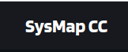
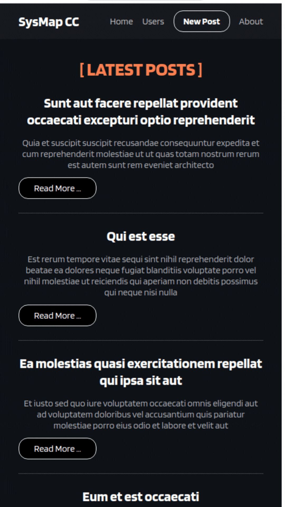

<h1 align="center">

</h1>


<h3 align="center">
  <a href="https://github.com/tvm-dev/codechallenge1">See Online Demo this Project click here</a></h3>

---
# Table of Contents ***
- [About](#-about)
- [Built With](#built-With)
- [How to run this project](#-how-to-run-this-project)
- [Contacts](#-contacts)
- [License](#-license)


---
#  About 👋 🎁
This Project was developed to fulfill a Code Challenge request for a job interview. **It consumes an open source API** called {JSON} Placeholder
- Link this Project: [https://github.com/tvm-dev/CodeChallenge1](https://github.com/tvm-dev/CodeChallenge1)
- ## See a Gif demo from project running: 🙂
### Running

<h1 align="center"></h1>

---
## Built With 💟

This Project was developed using the following technologies:

- [ReactJS](https://reactjs.org/)
- [Axios](https://axios-http.com/docs/intro)
- [ViteJS](https://vitejs.dev/)

---
## How to run this project

```bash

# Clone the repository
$ git clone https://github.com/tvm-dev/CodeChallenge1.git

# Enter the directory
$ cd CodeChallenge

# Install all project dependencies
$ npm install

# Start the project:
$ npm run dev
```
---
# Contacts 🖐️
### This project was development by **Thiago Viana**
- E-mail: tvm.dev2015@gmail.com
- Website: [thiagoviana.tk](https://thiagoviana.tk)
- WhatsApp: [+55 11 961312020](https://wa.me/5511961312020?text=Github)
- Linkedin: [https://www.linkedin.com/in/tvm-dev2015/](https://www.linkedin.com/in/tvm-dev2015/)


---
# License
Distributed under the MIT License. See LICENSE.txt for more information


